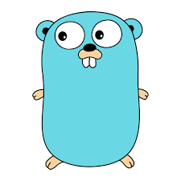

<style>
#left {
	margin: 10px 0 15px 20px;
	text-align: left;
	float: left;
	z-index:-10;
	width:48%;
	font-size: 0.7em;
	line-height: 1.2; 
}

#right {
	margin: 10px 0 15px 0;
	float: right;
	text-align: left;
	z-index:-10;
	width:48%;
	font-size: 0.7em;
	line-height: 1.2; 
}

#left-most {
	margin: 10px 0 15px 20px;
	text-align: left;
	float: left;
	z-index:-10;
	width: 64%;
	font-size: 0.85em;
	line-height: 1.2; 
}

#right-less {
	margin: 10px 0 15px 0;
	float: right;
	text-align: left;
	z-index:-10;
	width: 32%;
	font-size: 0.85em;
	line-height: 1.2; 
}

#left-less {
	margin: 10px 0 15px 20px;
	text-align: left;
	float: left;
	z-index:-10;
	width:43%;
	font-size: 0.85em;
	line-height: 1.2; 
}

#right-most {
	margin: 10px 0 15px 0;
	float: right;
	text-align: left;
	z-index:-10;
	width: 53%;
	font-size: 0.85em;
	line-height: 1.2; 
}


</style>

## Introduction to `Go` and comparison with `Python`

---

## Contents

- Why learn `Go`
- `Go` selling points
- `Go` vs `Python``
- Concurrency vs parallelism
- Conclusion

<!---
- Go: concurrency, speed, runtime, history,  imperative but with first-class function support. Ambition: get developers unfamiliar with the language up to speed quickly, easy to read others code and easier to maintain large codebases, go fmt. fast compiler. Standard library: testing, net/http
- Python: GIL, age of language (compare to C, C++, Java, Rust), 
	- Zen of Python: There should be only way of doing it.. go fmt.
	- deliberately boring, few keywords, somewhat verbose (example no ternary operator, for loop),
- Go controversial design decisions: error handling, no generics (until February!)
- Concurrency vs Parallelism
- Go arguments: embraced by CoopX, great backend language; Kubernetes, Docker
- Go Python interop, using C bindings.
- Go vs Rust - modern languages compared
- Go cons: Data Science tooling, no REPL
- References: Learning Go,
--->


---

## Why learn `Go`?

<div id="left-most">

- Great for backend development
- Maintained by Google, great support in Google Cloud Platform
- `CoopX` preferred language <br> (together with `Python`)
- Powerful concurrency tools
- Relatively easy to learn
- Learning another language is likely to make you a better `Python` programmer.

</div>

<div id="right-less">



</div>

---

# `Go` selling points 

--

## Ambitions / Design goals

- Onboard new developers quickly
	- Imperative (familiar to most)
	- Easy-to-read syntax
- Good choice for large software projects
	- Simple, small, "boring" language
	- Powerful developer tooling
- Fast execution, low memory footprint
- Runs natively on any platform
	- Cross compiles with is own runtime embedded

--

## Static type checking

<div id="left">

`python` is duck-typed by nature, but `mypy` can help.

```python
class Logic:
		def process(self, data):
				# business logic

def program(logic):
	  # get data from somewhere
		logic.process(data)

lgc = Logic()
program(lgc)
```
</div>

<div id="right">

`go` uses `interface`s instead of `class`es. No inheritance.

```go
type Logic interface {
	Process(data string)
}
func program(l Logic) {
	// get data from somewhere
	l.process(data)
}
//Any type implementing a Process
//method complies with Logic interface
type lgc struct {}
// Implement method Process on lgc
func (lg log) Process(data string) {
		// business logic
}

// Compile time error if not `lgc`
// implements the Process method!
program(lgc)
```

</div>

--

## Compile time

<div id="left">

Blazingly fast compiler

Compared to "all" other compiled languages, like `Java`, `C`, `C++`, `Rust`

Enables rapid prototyping and development

</div>

<div id="right">


</div>

--

## `Go` is fast

Comparable to `Java` and `C`.

No need for "glue code", to faster languages.

"Pure" `Python` is slow in comparison, but calling `C`/`C++` code with e.g. `numpy` or `pyTorch` gives comparable speeds.

--

## `Go` is small, simple, "boring"

<div id="left">

From the [Zen of Python](https://www.python.org/dev/peps/pep-0020/): <br>
`There should be one - and preferably only one - obvious way to do it.`

But `Python` has become a large language, not really conforming to this goal.

</div>


<div id="right">

`Go`, however, seems much closer to such a goal. 

- deliberately small (only 25 keywords)
- standard formatting tool [gofmt](https://go.dev/blog/gofmt)


</div>

--

#### `Go` is small, simple, "boring" example

Square a list of integers and find the sum.

<div id="left">

`python`

```python
l = [1, 2, 3, 4, 5]

s0 = 0
for x in l:
  s0 += x**2

s1 = sum(x**2 for x in l)

from functools import reduce
s2 = reduce(lambda x1, x2: x1 + x2, 
            map(lambda y: y**2, l))

assert(s0 == s1 == s2)
```

</div>


<div id="right">

`go`

```go
l := []int{1, 2, 3, 4, 5}

func sumOfSquares(nums []int) int {
	sum := 0
	for _, num := range nums {
		sum += num * num
	}
	return sum
}

s0 := sumOfSquares(l)

//Simplified: This is THE way to do it.
```

</div>


---

## `Go` vs `Python`

Why and when would you consider using `Go` instead of `Python`?

- speed (compare with Python)
- concurrency (compare with Python)
	- Concurrency vs Parallellism

--

## `Go` vs `Python` - data science

- The Data Science tooling of `Go` is immature
	- And is probably not as well suited language as `Python` and `R` for most data science work.
- No REPL, i.e. no notebooks

**Bottom line**: Not really the language I'd choose for data science.

--

## `Go` vs `Python` - concurrency

<div id="left">

`Python` has a major design "flaw" wrt. concurrency and parallelism: the *Global Interpreter Lock* (GIL). Concurrent and parallell computations in Python has to "hack" it's way around this limitation, or call another language (like `PyTorch` does).

Go, on the other hand, is designed _for_ concurrency. It's easy to use, and compiler will help you catch race conditions. 


</div>

<div id="right">


</div>

--

## Concurrency vs Parallelism

<div id="left">
 
Concurrency: useful when functions are IO or CPU bound.

E.g. making an REST API request, which is usually IO bound. If not concurrency enabled, IO bound means the CPU has to wait for the returned data before it can proceed. This is the general case in Python.

In `Go` it is very easy to make hundreds of thousands of concurrent `goroutines`!

</div>

<div id="right">


</div>

--

`Go` vs `Python` - generics

<div id="left">

`python`

```python

def concat(a, b):
		return a + b

concat(1, 2) # 3
concat("a", "b") # "ab"
```

</div>


<div id="right">

`go`

```go
func concatString(a, b string) string {
	return a + b
}

func concatNums(a, b int) int {
	return a + b
}

// Must be implemented for all types!
```

Until now, `Go` 1.18 will be released in February with Generics.

Show some code!

</div>

--

## `Go` vs `Python` - interop

`Go` has full `C` interop support

You can compile `Go` code to a `C` binary, which one could easily call from Python. See e.g. this [blog post](https://www.ardanlabs.com/blog/2020/07/extending-python-with-go.html) for how one could do it.

**Use cases**:
- Use `Go` for concurrency, e.g. scrape thousands of web pages quickly.
- Use `Go` for parallell computations.
- Use `Python` for anything data science, in a `Go` API.

---

## Conclusion

Should you learn `Go`? Not sure :D

If you like to learn more programming, go for it! It's a nice, useful language. 

SQL, Python, and potentially R, is more relevant for data science/analytics.


References:

- Book: [Learning Go](https://www.amazon.com/Learning-Go-Idiomatic-Real-World-Programming/dp/1492077216)